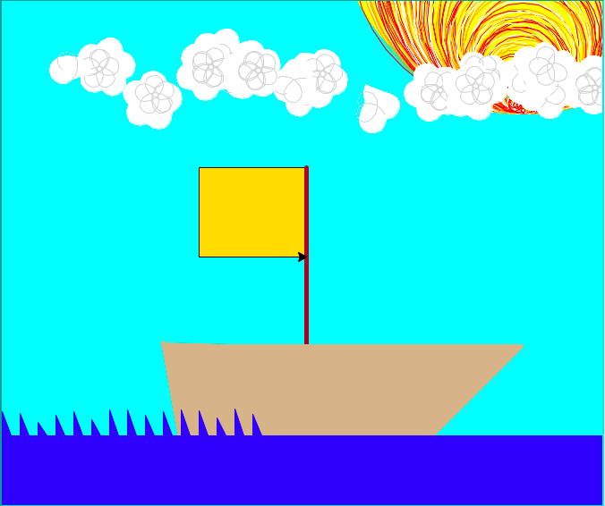

#### Markdown


Project for Markdown Challenge

This will be a link to an external website:

[Astronomy/Nasa Daily Picture](https://apod.nasa.gov/apod/)

This is my amazing boat from last semester that is in my directory...



[Second Page](Second.md)

*Italic Text*

**Bold Text**

A stranger said:
>Here is a Block Quote!

Here is a table
First Header | Second Header
------------ | -------------
This is X    | This is Y
This is Silly|This is Weird

Here is a numbered list
1. Item 1
2. Item 2
  2. Item 2Alpha
  2. Item 2Bravo

```Python
print("This a code block?")
```

Here is a horizontal rule
****
____
---


Amazing?
